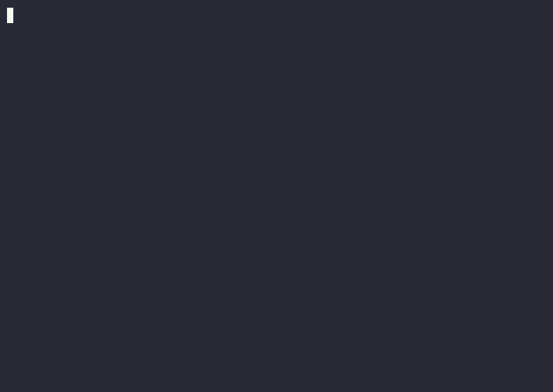

# Agent0Waste

> Local-first waste scanner for AI agent CLIs — Hermes, Claude Code, OpenCode, and more.
>
> v0.5.0 · **macOS-only** · Linux/Windows on the roadmap

Shows exactly what is wasting RAM, disk space, and tokens on your machine —
with **zero data leaving your device**.

<p align="center">
  
</p>

<p align="center">
  <em>Real scan output from <code>agent0waste scan</code> on the developer's machine. <a href="agent0waste-demo/renders/agent0waste-demo.mp4">Watch the 1920×1080 MP4</a> for full quality.</em>
</p>

---

## Why I built this

AI agent CLIs are getting powerful fast — and quietly expensive. I kept finding
abandoned profiles, bloated tool configs, and orphan cron jobs keeping remote
models warm on my own machine. Nothing surfaced that cleanly, locally, without
phoning home. So I built it.

This is a single-developer, macOS-first, Hermes-first project. Versions mark
"I trust this release on my own machine" — not marketing.

---

## What it does

Agent0Waste scans your local AI agent setup and finds waste:

- **Tool bloat** — expensive tools enabled by default that inflate context and slow inference
- **Dead profiles** — abandoned profiles consuming disk and config space
- **Orphan cron jobs** — scheduled jobs keeping expensive models alive
- **Memory layer pressure** — accumulated memory layers eating RAM
- **Model awareness** — detects local vs remote model + context window
- **Scan history** — tracks efficiency across multiple runs
- **Token accounting** — reads `~/.hermes/state.db` (SQLite) for real per-session token data
- **Heuristic warnings** — cache bloat, prompt growth, auto-routing, model instability
- **Layer 4 interception** — opt-in shim that consults heuristics before each LLM call. Supports fail-open (default) and opt-in fail-closed mode with a `--agent0waste-bypass` per-call override (audit-logged).
- **Layer 5 sandbox (experimental)** — opt-in `sandbox-exec` wrapper with a deny-default SBPL profile.

All detection is 100% local. No network calls. No telemetry.

---

## Installation

### From git (recommended)

```bash
cargo install --git https://github.com/beme08/Agent0Waste agent0waste
```

Works as soon as you clone the source. No `crates.io` publish yet — that
gates on the cross-platform work in the v0.5.0+ milestone.

### From source

```bash
git clone https://github.com/beme08/Agent0Waste.git
cd Agent0Waste
cargo build --release
./target/release/agent0waste
```

---

## Usage

All examples assume `agent0waste` is on your `PATH`. If you built from source,
prefix with `./target/release/`.

### Layer 1 — Audit

```bash
# Run a scan (default command)
agent0waste scan

# Scan with model override
agent0waste scan --model claude-sonnet-4-20250514 --provider anthropic

# Show scan history
agent0waste history
```

### Layer 2 — Accounting

```bash
# Run a command and record the session
agent0waste run -- <cmd> [args...]

# List recorded sessions
agent0waste sessions

# Cost report from recorded + Hermes sessions
agent0waste cost --since 7

# Cost report grouped by model / provider / day
agent0waste cost --by model --since 14
agent0waste cost --by provider
agent0waste cost --by day

# List models with no pricing entry (useful for filling gaps)
agent0waste cost --missing

# Export as JSON
agent0waste cost --export json
```

> The default cost report shows `$0.00` for models that aren't in the pricing
> table. Run `agent0waste cost --missing` to see which ones need rates added
> via `agent0waste pricing add <model> <input> <output>`.

### Layer 3 — Heuristics

```bash
# Run heuristics against the current state and emit a JSON decision
agent0waste intercept check --command "hermes chat"

# Show the rule table (severity × heuristic → action)
agent0waste intercept rules

# Render the decision pipeline as a human-readable trace
agent0waste intercept trace --command "hermes chat"

# Include heuristic warnings below the cost table
agent0waste cost --warnings
```

### Layer 4 — Interception

`agent0waste intercept enable <cmd>` installs a small bash shim in
`~/.local/share/agent0waste/shims/<cmd>` (**NOT** `~/.local/bin/`, which is
shared with cargo, uv, and homebrew). Add that directory to your `PATH` to
make interception active:

```bash
export PATH="$HOME/.local/share/agent0waste/shims:$PATH"
```

The shim records the call (Layer 2), runs heuristics on recent Hermes
sessions (Layer 3), and returns one of four decisions:

| Decision | Exit | Shim behavior |
|----------|------|---------------|
| `allow`  | 0    | exec the real binary |
| `throttle` | 64 | sleep `cooldown_s`, re-check, then exec anyway |
| `prompt` | 65   | ask the user y/N, exec on Y, exit 1 on N |
| `deny`   | 66   | **do not exec** the real binary |

**Fail-open by default** — if Agent0Waste is unreachable, the call proceeds
and a stderr message is logged.

**Fail-closed (opt-in).** Set `mode = "fail-closed"` in
`~/.config/agent0waste/intercept.toml` to make the default decision
**Deny** when no heuristic rule fires (the §5/§7 distinction: heuristic
timeouts and other runtime failures still fail-open). Users can override
per-call with `--agent0waste-bypass`; each bypass is audit-logged to
`~/.local/share/agent0waste/bypass.log`.

The shim is a real file you can `cat` and audit; nothing in your shell
rc or `~/.hermes/config.yaml` is touched.

```bash
# Install / remove / inspect the shim
agent0waste intercept enable hermes
agent0waste intercept status
agent0waste intercept disable hermes

# Run a command through the shim path (Layer 4 + Layer 2)
agent0waste intercept run -- hermes --version

# Per-call override when fail-closed denies (audit-logged)
hermes --agent0waste-bypass chat

# Move a legacy v0.4.0-alpha shim from ~/.local/bin/ to the new shim dir
agent0waste intercept migrate hermes
```

<p align="center">
  
</p>

<p align="center">
  <em>Real run of <code>scripts/v040-demo.sh</code> on the developer's machine. <a href="docs/validation.md#v040-beta--interception-validated-2026-06-03">See the validation record</a> for the full checklist + verbatim output.</em>
</p>

### Layer 5 — Sandbox (experimental, macOS-only)

`agent0waste intercept enable-sandbox <cmd>` wraps the real binary in
`sandbox-exec(1)` with a deny-default SBPL profile. Writes are restricted
to an allowlist (`~/.hermes`, `~/.local`, `~/.cache`, `/private/tmp`,
`/private/var/folders`, `/dev/null`); reads stay near-global. Network is
outbound-only.

```bash
# Enable / disable / validate the sandbox profile
agent0waste intercept enable-sandbox hermes
agent0waste intercept validate-sandbox hermes
agent0waste intercept disable-sandbox hermes
```

> **Status:** Layer 5 is wired into the binary and ships a default SBPL
> profile at `~/.config/agent0waste/sandbox/<cmd>.sb`, but the profile
> is templated at install time and the `validate-sandbox` smoke test
> has been observed to fail on some macOS versions. Treat as
> experimental. See [`docs/v0.4.3-design.md`](docs/v0.4.3-design.md).

### Pricing table

```bash
# Show all known models and their rates
agent0waste pricing list

# Print the path of the user's override file (and create it if missing)
agent0waste pricing path

# Add or update a model rate in the user's override file
agent0waste pricing add 'openrouter/owl-alpha' 0 0
agent0waste pricing add 'xiaomi/mimo-v2.5' 0.40 2.00

# Validate the override file
agent0waste pricing check
```

---

## Example output

Real capture from `agent0waste scan` on the developer's machine:

```
Agent0Waste — Local Token Waste Scanner

  reading config          16% [███░░░░░░░░░░░░░░░░░]
  scanning profiles       33% [██████░░░░░░░░░░░░░░]
  detecting model         50% [██████████░░░░░░░░░░]
  checking memory         66% [█████████████░░░░░░░]
  analyzing tools         83% [████████████████░░░░]
  computing waste        100% [████████████████████]
  scan complete          100% [████████████████████]

Model     : stepfun/step-3.7-flash:free (nous)  [remote]

Hermes profiles (10):
  hermes-cto           tools:  0  (clean)
  hermes-sec           tools:  0  (clean)
  hermes-pm            tools:  0  (clean)
  hermes-ml-droid      tools:  0  (clean)
  hermes-dev-droid     tools:  0  (clean)
  designer             tools:  0  (clean)
  shkumbins_dev        tools:  0  (clean)
  hermes-core          tools: 13  (3 expensive)
  hermes-dev           tools:  0  (clean)
  researcher           tools:  0  (clean)

Waste detected:
  [high] tool_bloat — 3 expensive tools enabled by default in hermes-core (web, browser, computer_use)
       → ~20-40k tokens/mo + lower RAM

Efficiency: 85% [█████████████████░░░]
If cleaned: 98% [███████████████████░]
  → -18k tokens/mo | +13% speed
Machine: macOS • Mac16,7
```

The model name and exact profile list will vary by machine — what's
constant is the structure: detected model, per-profile tool counts, the
single highest-severity waste finding, and the efficiency / if-cleaned
delta.

---

## Layer roadmap

| Layer | Status | What it does |
|-------|--------|--------------|
| 1 — Audit | shipped (v0.1) | Scan for config bloat, tool waste, memory pressure, model awareness |
| 2 — Accounting | shipped (v0.2.1) | Per-tool / per-model / per-session token tracking + cost estimation from `state.db` |
| 3 — Heuristics | shipped (v0.3.1) | `cache_bloat`, `prompt_growth`, `auto_routing`, `model_instability` findings |
| 4 — Interception | shipped (v0.5.0) | Per-command shim (`allow` / `throttle` / `prompt` / `deny`). Fail-open by default; opt-in fail-closed with `--agent0waste-bypass` override. macOS-only. |
| 5 — Sandbox | wired, experimental (v0.4.3) | `sandbox-exec` wrapper with deny-default SBPL profile. macOS-only. Validate before relying on it. |

See [`docs/roadmap.md`](docs/roadmap.md) for the full plan. Note that the
roadmap and the per-version design docs don't always agree on what each
milestone covers — the per-version design docs (e.g.
[`docs/v0.5.0-design.md`](docs/v0.5.0-design.md)) are the source of truth
for what's actually being built.

### What's next

- **Layer 5 sandbox hardening** — fix the `validate-sandbox` smoke-test
  failure observed on some macOS versions, scope the network policy to
  LLM provider hosts.
- **Cross-platform** — Linux and Windows support. The `run` wrapper and
  heuristic engine are already cross-platform; the macOS-specific bits
  (scanner, sandbox-exec, intercept shim) need feature flags. Target
  milestone: v0.5.0+ / v2 depending on which design doc you read.
- **Crates.io publish** — gated on the cross-platform work.

---

## Philosophy

Privacy-first. Local-only. No telemetry. No accounts.

If it can't run offline, it doesn't belong here.

---

## License

MIT
